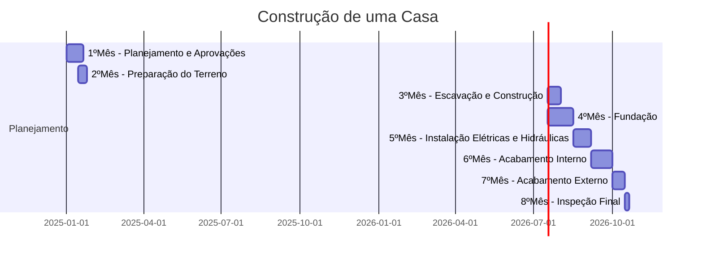
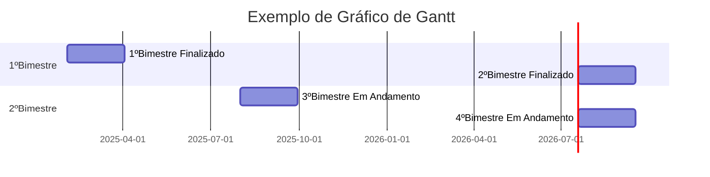
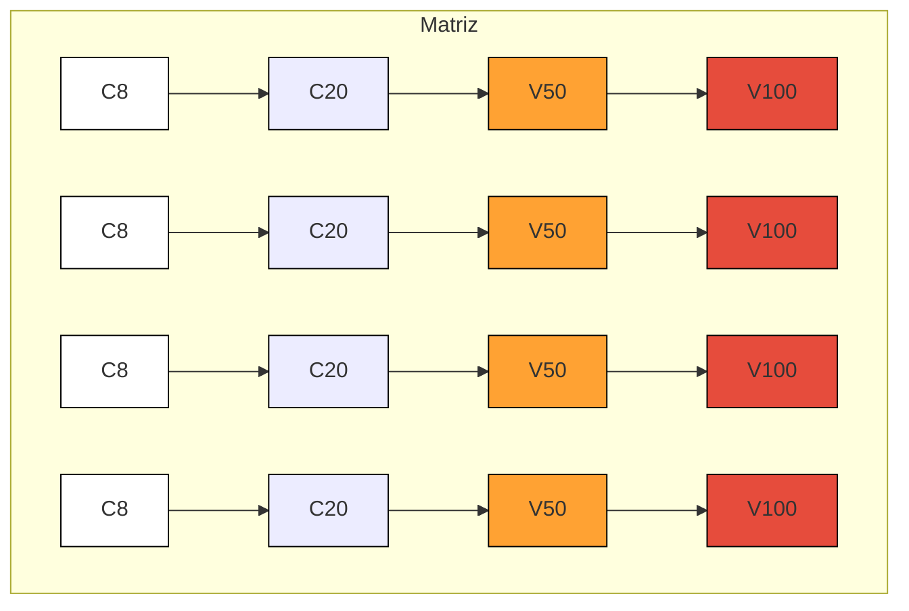
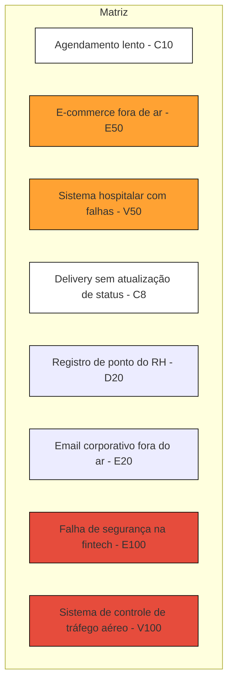
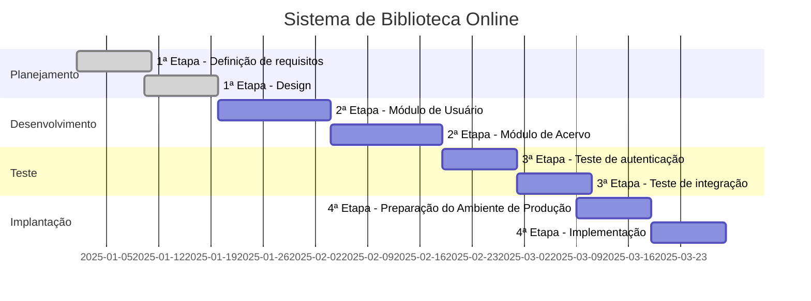
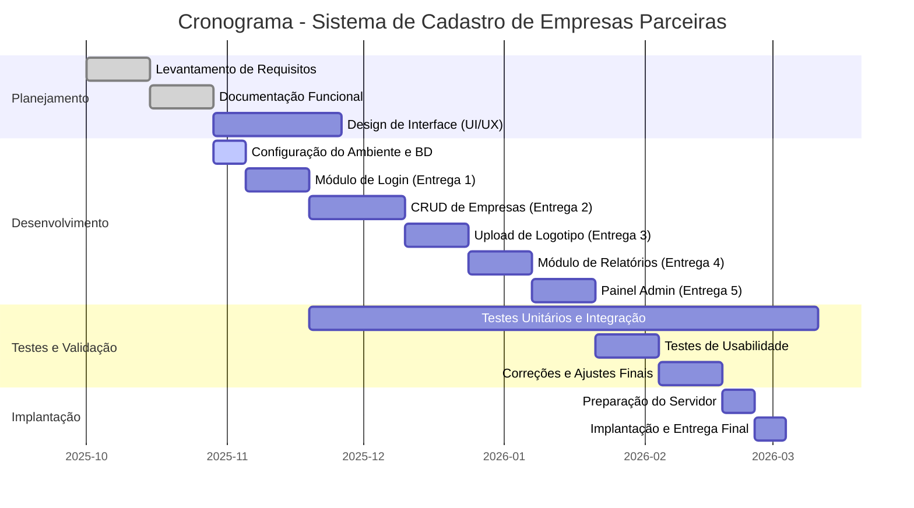
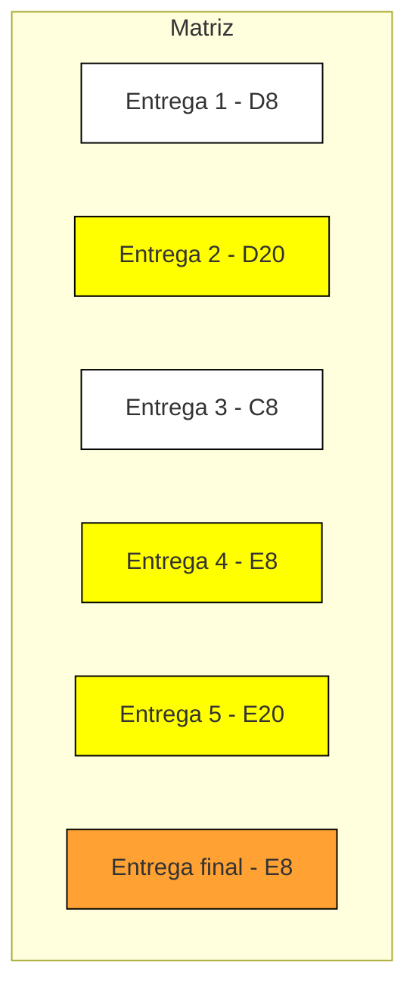

# grafico-gantt
Material desenvolvido na disciplina de Gestão Ágil de Projetos no terceiro semestre do curso de Desenvolvimento de Software Multiplataforma da FATEC de Registro

# crystal

# crystal - atividade 02

# Gráfico Gantt - Reposição FETEPS

# Atividade Grafico Crystal - Gantt

# Atividade Grafico Crystal - Crystal

